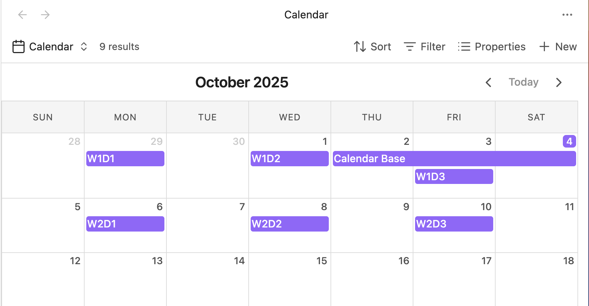

## Obsidian Calendar Bases



Adds a calendar layout to [Obsidian Bases](https://help.obsidian.md/bases) so you can display notes with dates in an interactive calendar view.

Built with [FullCalendar](https://fullcalendar.io/) for a robust and feature-rich calendar experience.

- Dynamically display entries that match your filters on their respective dates.
- Drag and drop events to reschedule them - automatically updates note frontmatter.
- Navigate between months with intuitive controls.
- Support for single-day and multi-day events (with optional end dates).
- Click entries to open them or use context menus for more options.

### Date Properties

To display entries on the calendar, configure a start date property in the view configuration menu. The property must contain a valid date string.

```yaml
# Date property examples
startDate: 2025-10-15
startDate: "October 15, 2025"
startDate: 2025-10-15T10:00:00

# Optional end date for multi-day events
endDate: 2025-10-18
```

Any JavaScript-parseable date format is supported. For multi-day events, configure both a start date and an optional end date property.

### Interaction

- **Drag and drop**: Click and drag events to new dates - the note's frontmatter will be automatically updated
- **Click entries**: Open notes directly from the calendar
- **Context menu**: Right-click entries for additional options
- **Hover**: Preview notes with Obsidian's page preview
- **Prev/Next buttons**: Navigate between months
- **Today button**: Jump back to the current date

### Features

- **Drag and drop rescheduling**: Move events to different dates with automatic frontmatter updates
- **Multi-day events**: Events with end dates span across multiple days
- **Responsive design**: Adapts to different screen sizes and viewport widths
- **Theme integration**: Automatically matches your Obsidian theme colors
